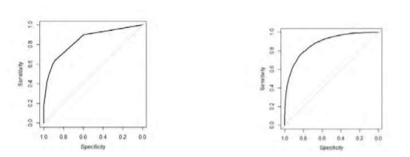
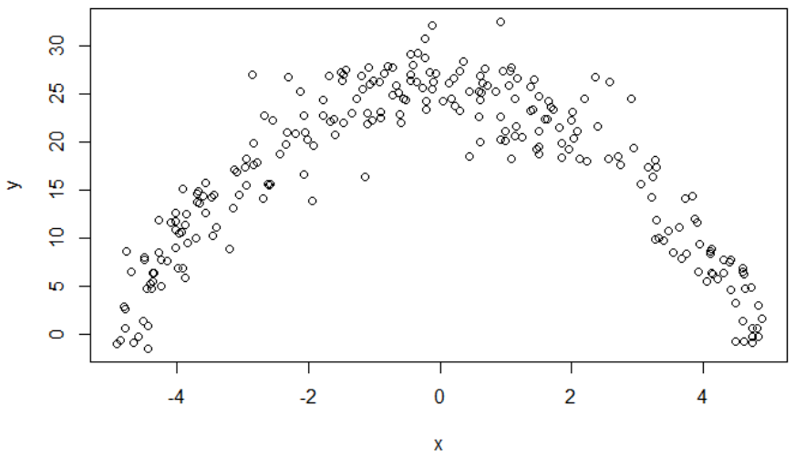

```{r setup, echo = F, message = F, warning = F}
library(learnr)
library(shiny)
library(caret)
library(stats)
library(gbm)
library(glmnet)
library(rpart)
library(rpart.plot)
library(pROC)
library(randomForest)
library(tidyverse)
library(dplyr)
library(e1071)
library(ISLR)
library(ExamPAData)

knitr::opts_chunk$set(echo = FALSE)
tutorial_options(exercise.cap = "Sandbox")

set.seed(42)

#GLMS
customer_value <- customer_value %>% 
  mutate(value_flag = ifelse(value_flag=="High",1,0))

#create a train/test split
index <- 1:as.integer(nrow(customer_value)*0.8)
customer_value_train <-  customer_value %>% slice(index)
customer_value_test <- customer_value %>% slice(-index)

sim_norm <- function(x) {
  rnorm(1, mean = x, sd = 1)
}

glmdata1 <- tibble(x = runif(10000)) %>% 
  mutate(y = x %>% map_dbl(sim_norm))

sim_norm <- function(x) {
  rnorm(1, mean = 1/x, sd = 1)
}

glmdata2 <- tibble(x = runif(10000)) %>% 
  mutate(y = x %>% map_dbl(sim_norm))

gammas <- rgamma(500, shape=2, scale = 0.5)

#random component
x <- runif(1000, min=0, max=100)

#relate Y to X with a log link function
y <- gammas*exp(x)

glmdata3 <- tibble(x = x, y  = y)

#Interactions
traffic_safety <- june_pa %>% select(-Light, -Weather, -Rd_Conditions) %>% 
  mutate(Time_of_Day = case_when(Time_of_Day %in% c(1,2) ~ "Morning",
                                 Time_of_Day %in% c(3,4) ~ "Day",
                                 Time_of_Day %in% c(5,6) ~ "Night"),
         Rd_Configuration = ifelse(Rd_Configuration %in% c("ONE-WAY", "UNKNOWN"), "OTHER", "TWO-WAY"),
         Traffic_Control = case_when(Traffic_Control %in% c("NONE", "OTHER")~ "OTHER",T~ "STOP-SIGNAL"),
         Rd_Feature = ifelse(Rd_Feature == "INTERSECTION", "INTERSECTION", "OTHER"))

#create a train/test split
index <- 1:as.integer(nrow(traffic_safety)*0.8)
traffic_safety_train <-  traffic_safety %>% slice(index)
traffic_safety_test <- traffic_safety %>% slice(-index)

#set factor levels to those with the most observations
health_insurance <- health_insurance %>% 
  mutate(sex = fct_infreq(sex),
         smoker = fct_infreq(smoker),
         region = fct_infreq(region),
         age_bucket = case_when(
           age < 24 ~ "<24",
           age <= 36 ~ "24-36",
           age <= 50 ~ "36-50",
           age > 50 ~ ">50"
         ) %>% as.character() %>% fct_infreq()
  )

#customer_value
customer_value <- customer_value %>%
  filter(age>=25) %>% 
  mutate(value_flag = ifelse(value_flag=="High",1,0),
         marital_status = ifelse(marital_status == "Married-AF-spouse", 
                                 yes = "Married-civ-spouse",
                                 no = marital_status)) 

#create a train/test split
index <- 1:as.integer(nrow(health_insurance)*0.8)
health_insurance_train <-  health_insurance %>% slice(index)
health_insurance_test <- health_insurance %>% slice(-index) %>% 
  mutate_if(is.character, fct_infreq)


#Student Success
student_success <- student_success %>% 
  mutate(parent_edu = Medu + Fedu,
         health_alcohol = (Walc + Dalc)/health)

## SOA Mortality

set.seed(42)
#For the sake of this example, only take 20% of the records
# soa_mortality <- soa_mortality %>% 
#   sample_frac(0.2) %>% 
#   mutate(target = as.factor(ifelse(actual_cnt == 0, 1, 0))) %>% 
#   select(target, prodcat, distchan, smoker, sex, issage, uwkey) %>% 
#   mutate_if(is.character, ~as.factor(.x))
# 
# index <- 1:as.integer(nrow(soa_mortality)*0.8)
# soa_mortality_train <- soa_mortality %>% slice(index)
# soa_mortality_test <- soa_mortality %>% slice(-index)

#Boston housing

index <- 1:as.integer(nrow(boston)*0.8)
train <-  boston %>% slice(index)
test <- boston %>% slice(-index)

x_boston_train <-  train %>% select(-medv) %>% as.matrix()
x_boston_test <- test %>% select(-medv) %>% as.matrix()

y_boston_train <- train$medv
y_boston_test <- test$medv

#use the mae as the evaluation metric
mae_summary <- function (data,
                         lev = NULL,
                         model = NULL) {
  out <- mae(data$obs, data$pred)  
  names(out) <- "mae"
  out
}

#your assistant has provided you with these functions
#no changes need to be made
mae <- function(y, y_hat){
  mean(abs(y - y_hat))
}
```

## Q1 - Recommend a tree model

There are two candidate tree models, a random forest and a decision tree.  The single tree was built and had an AUC against the test set of 0.8443.  The random forest had an AUC of 0.8785.  The ROC curves are below, with the single tree first.

Your client favors model performance over interpretability.

The paremters are

**Decision Tree:**

- `max.depth`: 5
- `minbucket`: 50
- `cp`: 0.01

**Random Forest:**

- `mtry`: 15
- `ntree`: 500
- `nodesize`: 3

```{r out.width="500px"}

```

**Which model should be chosen?**

```{r quiz-rf-3}
quiz(
  question("Choose the best answer",
           answer("Decision Tree.  The max.depth indicates that the decision tree is easy to interpret because only up to 5 variables will be used and these can be interpreted as yes/no questions.  The minbucket of 50 means that a minimum of 50 observations will ever be in a terminal leaf node.  The mtry of 15 means that 15 predictor variables will be considered at each split point.  For these reasons, I recommend the decision tree."),
           answer("Decision Tree.  The single tree has the advantage of being easy to interpret.  When making predictions for future applicants, a series of if/then statements will lead directly to a recommendation.  It is also clear how the predictor variables relate to the outcome.  The random forest is opaque because the predictor variables are put in and a prediction comes out."),
           answer("Random Forest.  Because our goal is to make good predictions, interpretation is less important.  As a result, I recommend choosing the model with the better predictive ability, which is the random forest because it has a higher AUC.  The max.depth of the tree is 5, meaning that the single tree is easier to interpret than the random forest.", correct = T),
           answer("Random Forest.  Because our goal is to make good predictions, interpretation is less important.  As a result, I recommend choosing the model with the better predictive ability, which is the random forest because it has a higher AUC.  The max.depth of the tree is 5, meaning that the random forest is easier to interpret than the single tree."),
           allow_retry = TRUE
  )
)

```


## Q2 - Model validation

An actuary has trained a predictive model and chosen the best hyperparameters, cleaned the data, and performed feature engineering.  They have one problem, however: the error on the training data is far lower than on new, unseen test data.  Read the code below and determine their problem.  Find a way to lower the error on the test data *without changing the model or the data.*  Explain the rational behind your method.

```{r rf-4-hint-1}
#read the documentation for ?trainControl
```


```{r rf-4-hint-2}
#A bootstrap sample is when samples are taken of the observations with replacement.  The default code was using `method = boot`, which is using a bootstrap.  It is strange that this only repeated twice, and each time the data is only train on `p = 0.2` percent (twenty percent!) of the training data.
```


```{r rf-4-hint-3}
#Try cross validation instead of the bootstrap
```

A bootstrap sample is when samples are taken of the observations with replacement.  The default code was using `method = boot`, which is using a bootstrap.  It is strange that this only repeated twice, and each time the data is only train on `p = 0.2` percent (twenty percent!) of the training data.  Because the training data is small, `n` is effectively smaller, which makes the model worse.  Additionally, because there are only two bootstrap replications, there is high variance in this estimate.

```{r rf-4, exercise = T, exercise.lines = 30}
control <- trainControl(
  method='boot', #make changes if appropriate
  number=2, 
  p = 0.2)

tunegrid <- expand.grid(.mtry=c(1,3,5))
rf <- train(charges ~ .,
            data = health_insurance_train,
            method='rf', 
            tuneGrid=tunegrid, 
            trControl=control)

pred_train <- predict(rf, health_insurance_train)
pred_test <- predict(rf, health_insurance_test)

get_rmse <- function(y, y_hat){
  sqrt(mean((y - y_hat)^2))
}

get_rmse(pred_train, health_insurance_train$charges)
get_rmse(pred_test, health_insurance_test$charges)
```

```{r quiz-rf-4}
quiz(
  question("Explain why the training error is so much lower than the test error for the above model, and, if possible, make changes reduce this difference",
           answer("A bootstrap is when observations are taken with replacement from the data and used to train a model.  The error on the training set is lower than on the test set because the model has already 'seen' these records and learned their patterns.  The RMSE on the test set is higher because it has not yet 'seen' these observations.  There are no changes needed.", message = "These statements are correct, however, there is a better answer which reduces the overfitting."),
           answer("A bootstrap is when observations are taken without replacement from the data and used to train a model.  The error on the training set is lower than on the test set because the model has already 'seen' these records and learned their patterns.  We can reduce this difference by sampling different observations each time, known as cross-validation, as well as by using a higher sampling percentage by setting `p = 0.90`.  Using `number = 3` will ensure that the bootstrap gets repeated twice, further reducing the overfitting.", message = "While using cross-validation will reduce overfitting, using a larger sample percentage would increase the likelihood of overfitting.  In addition, using only 3-folds is rather low.  Using 5-fold or 10-fold CV is a better option."),
           answer("A bootstrap is when observations are taken without replacement from the data and used to train a model.  The error on the training set is lower than on the test set because the model has already 'seen' these records and learned their patterns.  We can reduce this difference by repeating the the bootstrap several times.  The default value of `number = 2` is too low and so increasing this to 5 leads to improvement.", message = "These statements are correct, however, there is a better answer which reduces the overfitting."),
           answer("A bootstrap is when observations are taken without replacement from the data and used to train a model.  The error on the training set is lower than on the test set because the model has already 'seen' these records and learned their patterns.  We can reduce this difference by taking a smaller sample percentage at each bootstrap and repeating this process multiple times.  We adjust for this by setting `number = 5` and `p = 0.75`."),
           answer("A bootstrap is when observations are taken without replacement from the data and used to train a model.  The error on the training set is lower than on the test set because the model has already 'seen' these records and learned their patterns.  We can reduce this difference by sampling different observations each time, known as cross-validation, as well as by repeating the process 10 times.", correct = T, message = "This combination leads to the smallest amount of overfitting.  The difference in RMSE in the training and test sets when `method = cv`, `number = 10`, and `p = 0.8` is (TRAIN: 2,768, TEST: 4,066).  
           For comparison, the default is (TRAIN: 2,774, TEST: 4,088) and using `method = boot` and `number = 10` with `p = 0.75` leads to (TRAIN: 2,766, TEST: 4,065)"),
           allow_retry = TRUE
  )
)

```


## Q3 - Split
**SRM Practice Question 10**: Determine which of the following statements about random forests is/are true?

I) If the number of predictors used at each split is equal to the total number of available predictors, the result is the same as using bagging.

II) When building a specific tree, the same subset of predictor variables is used at each split.

III) Random forests are an improvement over bagging because the trees are decorrelated.

```{r quiz-Q3}
quiz(
  question("Select the correct answer.",
    answer("(A) None"),
    answer("(B) I and II only"),
    answer("(C) I and III only", correct = TRUE,
           message = 'II is false because with random forest a new subset of predictors is selected for each split.'),
    answer("(D) II and III only"),
    answer("(E) The correct answer is not given by (A), (B), (C), or (D)."),
    allow_retry = TRUE
  )
)
```


## Q4 - Random forest vs GLM
**SRM Practice Question 39**: You are given a dataset with two variables, which is graphed below. You want to predict y using x.



```{r quiz-Q4}
quiz(
  question("Determine which statement regarding using a generalized linear model (GLM) or a random forest is true.",
    answer("(A) A random forest is appropriate because the dataset contains only quantitative variables."),
    answer("(B) A random forest is appropriate because the data does not follow a straight line."),
    answer("(C) A GLM is not appropriate because the variance of y given x is not constant."),
    answer("(D) A random forest is appropriate because there is a clear relationship between $y$ and $x$."),
    answer("(E) A GLM is appropriate because it can accommodate polynomial relationships.", correct = TRUE,
           message = '(A) is false. Trees work better with qualitative data.
           
(B) is false. While trees accommodate nonlinear relations, as seen in (E) a linear model can work very well here.

(C) is false. The variance is constant, so that is not an issue here.

(D) is false. There is a clear relationship as noted in answer (E).

(E) is true. The points appear to lie on a quadratic curve so a model such as $y = \\beta_0 + \\beta_1 x + \\beta_2 x^2$ can work well here. Recall that linear models must be linear in the coefficients, not necessarily linear in the variables.'),
    allow_retry = TRUE
  )
)
```


## Q5 - Split
**SRM Practice Question 41**: For a random forest, let $p$ be the total number of features and $m$ be the number of features selected at each split.

Determine which of the following statements is/are true.

I) When m = p, random forest and bagging are the same procedure.
II) $(p-m) / p$ is the probability a split will not consider the strongest predictor.
III) The typical choice of $m$ is $p/2$.

```{r quiz-Q5}
quiz(
  question("Select the correct answer.",
    answer("(A) None"),
    answer("(B) I and II only", correct = TRUE,
           message = 'I is true. Random forests differ from bagging by setting $m < p$.
           
II is true. $p – m$ represents the splits not chosen.

III is false. Typical choices are the square root of $p$ or $p/3$.'),
    answer("(C) I and III only"),
    answer("(D) II and III only"),
    answer("(E) The correct answer is not given by (A), (B), (C), or (D)."),
    allow_retry = TRUE
  )
)
```